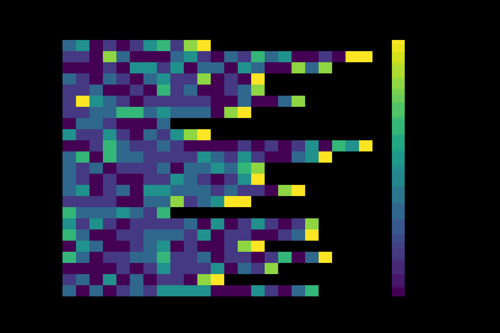
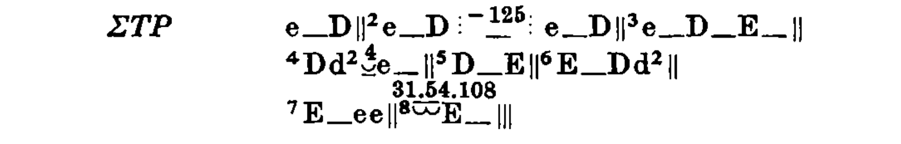

# Responsio Accentuum 

Software to measure virtual constraints on melody and accentual responsion in Greek polystrophic lyric, mainly Pindar. This project builds on and generalizes my previous work on the songs of Aristophanes, found [here](https://github.com/Urdatorn/aristophanis-cantica).

# TODO 

- *Make barys and acute-circumflex responsions non-binary as well, so can make heat map of a full ode showing degree of responsion tendency.*
- make Frankenstein null baseline strophes by searching odes for lines with the same lengths as P4, being careful not to include to lines from the same ode in the same line in diff strophes

## Copyright and citation

The script `stats_comp.py` contains adaptations of code from the [Greek-Poetry](https://github.com/aconser/Greek-Poetry) repository, which is copyright Anna Conser 2022 under the MIT licence. The license is quoted in its entirety in the doc string of that file.

This repository, however, is under the copyleft GNU GPL 3 license (compatible with the MIT license), which means you are more than welcome to fork and build on this software for your own open-science research, as long as your code retains an equally generous licensing.

