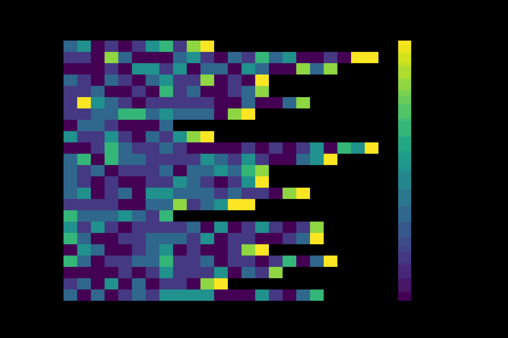
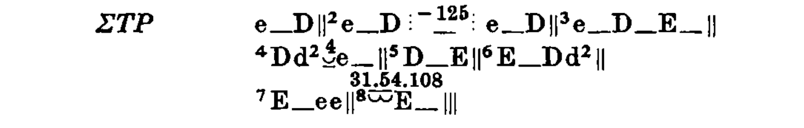

# Responsio Accentuum - Accentual Patterns in Archaic Lyric Song
[](https://orcid.org/0009-0003-3731-4038)


## What is it?

**Responsio Accentuum** is a suite of software to mark and measure accentual responsion patterns and extract constraints on how the text in Greek polystrophic archaic lyric were set to musical melodies. 

The central case study is Pindar and his 40 polystrophic victory odes or *Epinicia* (comprising 11 379 metrical positions) and the 5th victory ode of Bacchylides, the only fully extant ode by a rival of Pindar's.[^1] 

For an approachable visualization and explanation of the results, see the companion Github Pages [website](https://urdatorn.github.io/responsio-accentuum/).

This project builds on and generalizes my previous work on the songs of Aristophanes, found [here](https://github.com/Urdatorn/aristophanis-cantica), which in its turn partly uses a fork of the work of Anna Conser; see the Copyright section below. The core code is found in the source files ```stats[...].py```. To see the code in action, see the ```.ipynb``` notebooks. 

<!--
## TODO 

- What if we just ignore the last position of every line in the statistical tests, because they are obviously not significant? Or maybe they do not matter since they cancel out against the baseline?
- Recalculate χ-square and beta tests against new baselines
- Choose the most informative images to be included in the article.

## Chronology

- Pindar (c. 518-438): 
  - e.g. Battle of Salamis 480 referred to in ode
  - 76th Olympiad in 476 has five odes
- Chronology all songs with p < 5%
  - ne03: 475 ?
  - is04: 474/3 ?
  - py01: 470
  - is02: 470?
  - py04: 462
  - ne08: 459 ?
  - ne10: 444 ?
-->

[^1]: Four of the preserved odes have no responding parts at all, i.e. no refrains. Note that only 37 of the 40 responding songs have separate strophes and antistrophes, so if the responding unit of interest is the strophe instead of the strophe-antistrophe-epode triad, the corpus is slightly smaller. 

## Format

To analyze a song, the refrains first need to be scanned and presented in the format expected by the compiler. Here's a dummy example: 

```
<?xml version='1.0' encoding='UTF-8'?>
<TEI>
  <teiHeader>
    <fileDesc>
      <titleStmt>
        <title>Test</title>
        <author>NA</author>
      </titleStmt>
    </fileDesc>
  </teiHeader>
  <text>
    <body>
      <canticum>
        <strophe type="strophe" responsion="te01">
          <l n="1" metre="">[ὦ ]{φέ}[ρισ]{τέ}</l>
        </strophe>
        <strophe type="strophe" responsion="te01">
          <l n="2" metre="">[ὦ ]{κά}[κισ]{τε}</l>
        </strophe>
      </canticum>
    </body>
  </text>
</TEI>
```

The ```<canticum>``` element exists so that a file can contain more than one song. The responding refrains of a song are nested inside the ```<canticum>``` as ```<strophe>``` elements, which in their turns have their lines as ```<l>``` elements. To make the markup process less arduous, the syllable-level is first entered as human-readable pseudo-markup with square brackets enclosing long syllables and curly brackets enclosing short. Ancipitia have a hashtag (#) after the opening bracket and resolved pairs of shorts both have euro signs (€) after their opening brackets. Line-final short syllables automatically get the attribute ```brevis_in_longo="True"```. After compilation, the final xml lines will have proper ```<syll>``` elements with attributes stating anceps or resolution.

## Copyright and citation

The script `stats_comp.py` contains adaptations of code from the [Greek-Poetry](https://github.com/aconser/Greek-Poetry) repository, which is copyright Anna Conser 2022 under the MIT license. The license is quoted in its entirety in the doc string of that file.

For Pindar, I am partly using scansions derived from the [Hypotactic website](https://hypotactic.com/latin/index.html), which is under the [CC-BY 4.0](https://creativecommons.org/licenses/by/4.0/) license. The author David Chamberlain (University of Oregon) interprets the license in the following way:

> All the data on this site is/are licensed as CC-BY 4.0. That means that you can use it as you wish, but if you make significant or extensive use of it in published work you should reference me (David Chamberlain) and this site (hypotactic.com) as the source of the information (this constitutes my interpretation of the licence's "reasonable manner" language). By "data" I mean the tagging of individual syllables of verse with metrical attributes such as quantity, elision, hiatus, synizesis etc., and the identification of those syllables as independent metrical units.* To be clear, I do not intend to place any restrictions that go beyond standard academic attribution conventions; rather, I would like to encourage others to use the data as they will. The licence is intended to reassure you that that's OK.

The present repository itself, however, is under the copyleft GNU GPL 3 license (compatible with the MIT license), which means you are more than welcome to fork and build on this software for your own open-science research, as long as your code retains an equally generous licensing. The author is Albin Ruben Johannes Thörn Cleland, a PhD student at Lund university, Sweden.

